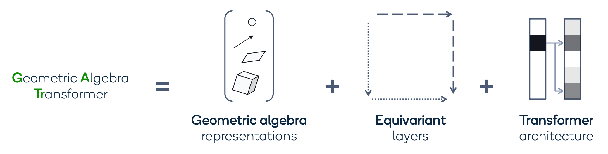
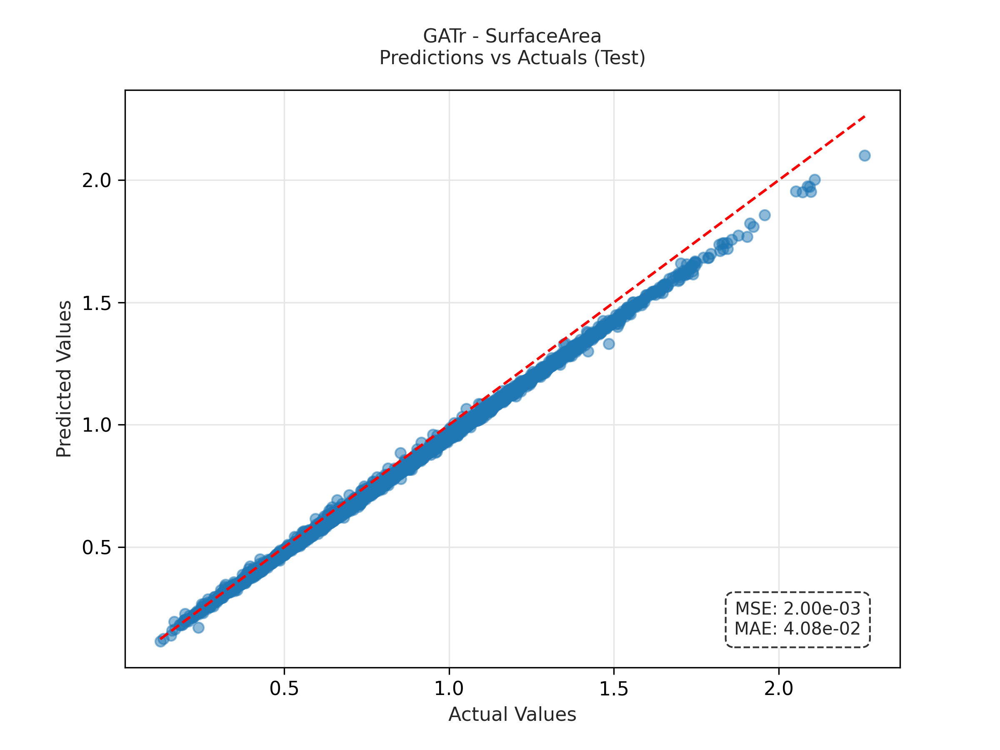

# Understanding complex geometric reasoning with Geometric Algebra Transformers

Author: Ajay Manicka

This repository investigates the spatial reasoning capabilities of Geometric Algebra Transformers (GATr) by testing the architecture on geometric reasoning tasks of increasing complexity. It extends the official implementation of the [**Geometric Algebra Transformer**](https://github.com/Qualcomm-AI-research/geometric-algebra-transformer/tree/main) by [Johann Brehmer](mailto:jbrehmer@qti.qualcomm.com), Pim de Haan, Sönke Behrends, and Taco Cohen, published at NeurIPS 2023.



## 1 Motivation

Morphometric diffusion models generate realistic 3D anatomical structures by modeling clinically relevant features like shape and size. An important application of these models is to give users control over desired features in generated 3D anatomic shapes. For example, it may be important to have control over features (volume, shape, etc.) of generated arteries when simulating coronary artery stent expansion.

Diffusion transformers can be used as the backbone of morphometric diffusion models since they model complex relationships in large datasets. While these models demonstrate success in generating realistic 3D shapes superior to U-net architectures, it is not clear how they perform on spatial reasoning tasks of increasing complexity. Therefore, it is worth investigating if substituting the transformer backbone with a different architecture will yield improved performance on spatial reasoning tasks.

One alternative architecture is the Geometric Algebra Transformer (GATr), which may improve spatial reasoning by directly representing data as multivectors of the projective geometric algebra on complex shapes. Geometric algebra provides a structured framework that could enhance the diffusion model's understanding of 3D morphology, enabling a more accurate representation of complex structure. In the context of morphometric diffusion models, this could be useful for generating realistic 3D anatomic shapes which are intrinsically complex.

This project aims to investigate the spatial reasoning capabilities of GATr by testing the architecture on a variety of geometric reasoning tasks. It aims to characterize how the GATr's geometric reasoning capability scales with problem complexity.


## 2. Getting started

Clone the repository.

```bash
git clone https://github.com/Ajay-M-create/GATr-experiments.git
```

Build the Docker image from inside the checked-out repository. On Linux, this can be done using

```bash
cd GATr-experiments
docker build -f docker/Dockerfile --tag gatr:latest .
```

The commands for Windows are similar.

Once the image has built successfully, we can run a container that is based on it.

On Linux, the command that does this and also

- mounts the current working directory into the container
- changes to the current working directory
- exposes all of the host's GPUs in the container

is

```bash
docker run --rm -it -v $PWD:$PWD -w $PWD --gpus=all gatr:latest /bin/bash
```

## 3. Running experiments

In this repository, we include two experiments: one on a synthetic n-body modeling problem and one
on predicting the wall shear stress on artery walls.

Running experiments will require the specification of directories for datasets, checkpoints, and
logs. We will define a common base directory (feel free to adapt):

```bash
BASEDIR=/tmp/gatr-experiments
```

### Example surface area calculation

First, we need to generate training and evaluation datasets:

```bash
python scripts/generate_surface_area_dataset.py base_dir="${BASEDIR}" seed=42
```

NOTE: You may need to comment the last three lines of GATr-experiments\config\model\gatr_surface_area.yaml for this part, but uncomment them for the next part.

Let's train a GATr model, using just 5000 (or 5%) training trajectories and training for 10000 steps:

```bash
bash ajay_scripts/gatr_surface_area.sh
```

At the end of the training, evaluation metrics are printed to stdout
and written to `$BASEDIR/experiments/surface_area/gatr/metrics`. Training and evaluation are also
tracked with MLflow to an SQLite database at `$BASEDIR/tracking/mlflow.db`.
MLFlow is configured in the `mlflow` section of `config/surface_area.yaml`.

We can repeat the same for different baselines, for instance:

```bash
bash ajay_scripts/transformer_surface_area.sh
```

On the `eval` set (without domain shift), you should get graphical results like this:


### Repository structure

The repository is organized as follows:

- `ajay_scripts/`: Contains shell scripts for running different experiments with both GATr and transformer baselines
- `blog_final/`: Contains the project blog/documentation with detailed results and analysis
- `config/`: Contains configuration files for experiments and models using Hydra
- `docker/`: Contains Docker setup files for reproducible environments
- `gatr/`: Main package directory containing model implementations and utilities
- `scripts/`: Python scripts for generating datasets and running experiments
- `tmp/`: Directory for experiment outputs, datasets, and tracking

The main experiments can be run using the scripts in `ajay_scripts/`, with results and tracking stored in the `tmp/gatr-experiments/` directory.
